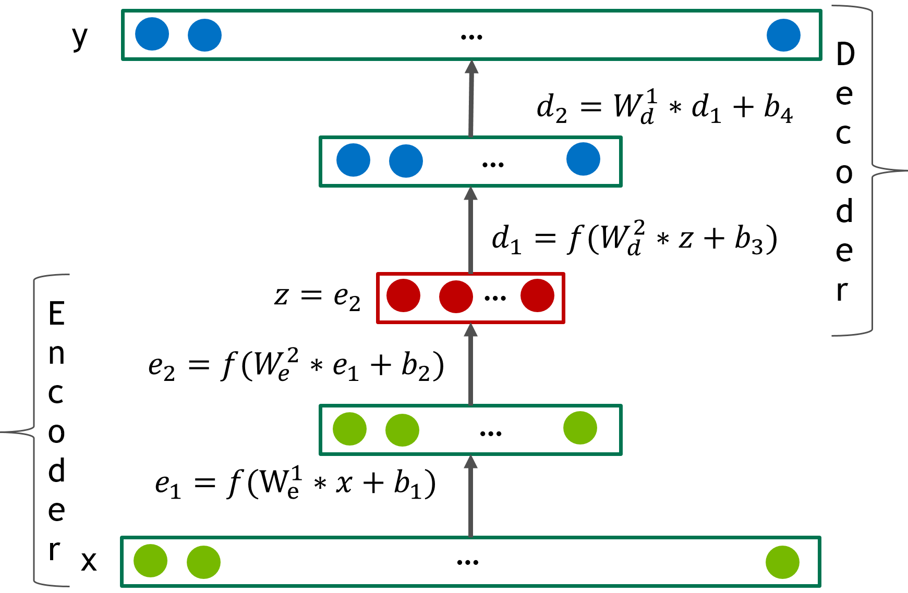

Использован подход, описанный в статье 
"Training Deep AutoEncoders for Collaborative Filtering"(https://arxiv.org/abs/1708.01715)

## 1. Терминология

##### 1.1 Модель Адео

Товарная категория Адео.
Обученный алгоритм, в сфере машинного обучения, принято называть Моделью.   
Однако, в компании LeroyMerlin Моделью принято называть категорию товаров, утвержденную ADEO.    
Так как проект опирается на активное использование Моделей Адео, слово Модель   
будет использоваться только в значении Товарной категории.  
  
##### 1.2 Автоэнкодер

Обученный алгоритм, который в сфере машинного обучения называется моделью.  
Мы обучаем Автоэнкодер, и Автоэнкодер делает прогнозы.  
  
##### 1.3 Проект клиента
  
То, что сейчас делает клиент. 
Ремонт дома, строительство сарая, установка окна, ремонт протекающего бачка унитаза, это   
все проект.  
Проект может быть простым, или состоять из этапов. На каждом этапе клиенту необходимы   
определенные типы товаров.  

## Требования
* Python 3.6
* Pytorch 0.4.0
* CUDA >= 8.0

В данном приложении исплоьзуются Deep Autoencoders для создания системы рекоммендаций для   
клиентов LeroyMerlin.  
В данном файле описано, по какому принципу организован API для оболочки автоэнкодэра.  
Автоэнгодэр в этом приложении создан с использованием библиотеки [PyTorch](http://pytorch.org/)
и основан на репозитории NVIDIA.

Для API мы используем библиотеки:
* [Flask](http://flask.pocoo.org/) - микрофреймворк, созданный на Python, для запуска web 
приложений
* [CherryPy](https://cherrypy.org/) - минималистичный фреймворк для создания web приложений 
на Python

## Адаптация модели для Leroy Merlin

Выбранная модель была создана в 2017 году, и показала очень высокую точность предсказания. 
Изначально модель создана и протестирована на пользовательских оценках фильмов из базы данных 
Netflix.

### Товарные категории (модель Адео) вместо конкретных товаров

Основная цель Алгоритма - угадать проект клиента, понять, на какой он стадии, и предложить 
нужные продукты.
Модель не ставит себе целью понять, какую именно, к примеру, дрель предложить клиенту.
Цель модели - угадать, что конкретному клиенту в данным момент потребоваться дрель, и 
сократить его путь к данной категории.
Ввиду этого, первым этапом артикулы заменяются на модели Адео, в которых они находятся.

Данный подход, модель Адео вместо конкретного артикула, имеет ряд преимуществ:
* Снижается зависимость от периода обучения. 
Если происходит смена коллекции, и одни дрели заменяются на другие, 
Автоэнкодер всегда работает с одной единицей - моделью Дрели.
* Значительно сокращается количество анализируемых продуктов (со 190тыс до 10тыс), 
благодаря чему в десятки раз повышается точность Автоэнкодера.
* Модель не зависит от того, что в разных городах разные гаммы товаров.
* Модель сможет легко работать с новинками, включая товары лонгтейл и маркетплейс.
* Более простая постобработка рекоммендаций - получаем номер модели, 
накладываем нужные нам фильтры (например, предлагаем только СТМ)
* Ввиду того, что модели Адео международные, есть возможность работать с одним Алгоритмом 
(как дообучать, так и пользоваться), как в России, так и в других странах, в которых базы 
данных основаны на Step.

### Проекты имеют жизненный цикл и порядок

Система рекоммендаций для DIY существенно отличается от таковой для FMCG, Фильмов, Музыки. 
Цель данной модели - улучшить изначальный алгоритм, чтобы учесть следующие факторы.

* Проект клиента - пошаговый процесс. Например, если клиент купил напольное покрытие, то,
 несмотря на то, что 

# Подготовка данных

Первый этап - конвертация данных в формат, который Автоэнкодер сможет прочитать.
Это может занять  ..... часов

Код:
%% time
%% run ./DeepRecommender/data_utils/leroy_data_convert.py

Скрипт разделяет данные на Тренировочный, Тестовый и Валидационный, 
создавая файлы с тремя колонками: CustomerID, ModelID, Probability

Ниже таблица с данными:

Взглянем на один из файлов:

Код:
%% lm_valid = os.path.join(LM_DATA, 'LM_VALID', 'lm.valid.txt')
%% df = pd.read_csv(lm_valid, names=['CustomerID','MovieID','Probability'], sep='\t')
%% print(df.shape)
%% df.head()

| CustomerID  |      ModelID      |  Probability |
|-------------|:-----------------:|-------------:|
| col 1 is    |  left-aligned     | $1600        |
| col 2 is    |    centered       |   $12        |
| col 3 is    | right-aligned     |    $1        |

Код:
%% lm_test = os.path.join(LM_DATA, 'LM_VALID', 'lm.valid.txt')
%% df2 = pd.read_csv(lm_valid, names=['CustomerID','MovieID','Probability'], sep='\t')
%% print(df2.shape)
%% df2.head()

| CustomerID  |      ModelID      |  Probability |
|-------------|:-----------------:|-------------:|
| col 1 is    |  left-aligned     | $1600        |
| col 2 is    |    centered       |   $12        |
| col 3 is    | right-aligned     |    $1        |

# Deep Autoencoder для коллаборативной фильтрации

Теперь у нас есть данные, и можно объяснить используемую обучающую модель.     
Модель, разработанная NVIDIA, это Deep Autoencoder с 6 слоями с нелинейной функцией      
активации SELU (scaled exponential linear units)  

Автоэнкодер это сеть, которая реализует две трансформации:   
$encode(x): R^n -> R^d    
$decoder(z): R^d -> R^n    

Цель автоэнкодера - получить d размерное представление данных   
таким образом, чтобы ошибка измерений между x и f(x) = decode(encode(x)) была минимальна.   
На следующем рисунке изображена архитектура Автоэнкодера.   
Энкодер имеет два слоя e^1 и e^2 и Декодер имеет два слоя d^1 и d^2.
Исключение может быть добавлено на уровень кодирования z.
Авторы Автоэнкодера экспериментируют с различным числом слоев от 2 до 12.   

  

В процессе обучения модель получает представление по клиенту в формате вектора из тренировочного   
сета x R^n, где n это число МоделейАдео.   
Обратите внимание, что вектор x очень разреженный, и имеет всего несколько значений из тысячи,   
в то время как искходящий вектор декодера, y = f(x) является плотным, и содержит предстказания   
по всем Моделям Адео в векторе. Потери представляют собой среднеквадратическую ошибку   
RMSE (root mean squared error).

Одна из ключевых идей авторов это dense re-feeding.
Давайте представим идеальный сценарий, с идеальной функцией f.   
Тогда f(x)i = xi (исходящий векторо точно повторяет входящий), и функция предугадывает все будущие   
покупки. Это означает, что если клиент покупает новый товар k (тем самым создавая новый вектор x)   
тогда f(x)k = x'k и f(x) = f(x'). Следовательно, авторы авторы заново подают вход в автоэнкодер,    
чтобы увеличить объем данных.

Метод состоит из следующих шагов:

1. Дан разреженный вектор x, делаем расчет, получаем f(x) и потери.
2. Передаем обратно потери и обновляем веса.
3. Рассматриваем f(x) как ноый пример и считаем f(f(x))
4. Вычисляем второй обратный проход.

Шаги 3 и 4 могут быть повторены несколько раз.

В конце, авторы исследуют различные функции активации. Они обнаружили, что ELU, SELU и LRELU,   
которые имеют ненулевые негативные части, показывают намного более хороший результат, чем  SIGMOID, RELU, RELU6 и TANH.   

Теперь запускаем тренировку модели. Параметры модели находятся в файле [parameters.py]('./parameters.py')

# API

Проект включает API для системы рекоммендаций. Первый шаг - взять данные о клиенте и сделать    
их доступными как json для выполнения запроса.

Код:
%% titles = pd.read_csv(MOVIE_TITLES, names=['MovieID','Year','Title'], encoding = "latin")
%% titles.head()

# Заключение 

Модель показала себя достаточно быстрой, чтобы быть реализованной в любой системе временем ответа   
в 4ms и может быть легко тренируема на GPU за 45 минут.

